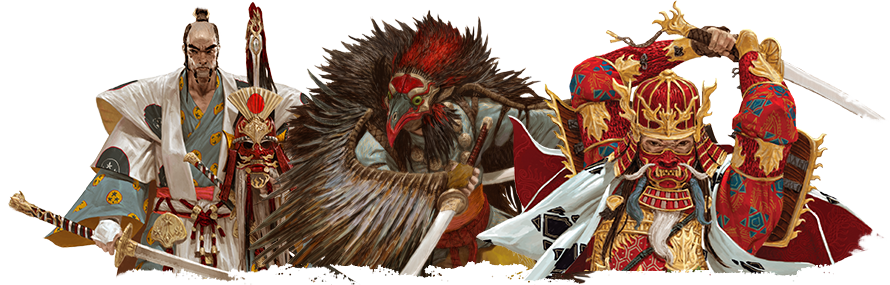

# Rising Sun

<!-- START doctoc generated TOC please keep comment here to allow auto update -->
<!-- DON'T EDIT THIS SECTION, INSTEAD RE-RUN doctoc TO UPDATE -->

- [Objective](#objective)
    - [How to get VPs](#how-to-get-vps)
- [Setup](#setup)
  - [Player Setup](#player-setup)
  - [Kami Setup](#kami-setup)
  - [Prepare The season decks](#prepare-the-season-decks)
  - [Last Steps](#last-steps)
- [Playing the Game](#playing-the-game)
  - [Things to Keep in Mind](#things-to-keep-in-mind)
  - [The Seasons](#the-seasons)
  - [Seasonal Setup](#seasonal-setup)
  - [Tea Ceremony](#tea-ceremony)
  - [Political Phase](#political-phase)
  - [War Phase](#war-phase)
    - [Battle Outcome](#battle-outcome)
    - [WAR REPARATIONS](#war-reparations)
  - [Seasonal Cleanup](#seasonal-cleanup)
  - [Winter Season](#winter-season)
- [Gloss](#gloss)
  - [Alliances](#alliances)
  - [Mandates](#mandates)
    - [Recruit](#recruit)
    - [Marshal](#marshal)
    - [Train](#train)
    - [Harvest](#harvest)
    - [Betray](#betray)

<!-- END doctoc generated TOC please keep comment here to allow auto update -->

# Objective

Players compete to lead their Clans to victory by accumulating Victory Points over the course of the Seasons. 

It begins with Spring, followed by Summer, and then Autumn. When Winter comes, the game draws to a close.

We will forge and break alliances, choose political actions, worship the gods, customize our clans, and position our figures around Japan. 

Victory Points can be gained in several ways, from winning battles, harvesting the right provinces, playing to the Virtues accumulated by your Clan. 

By the time Winter arrives, the player with the most points will rule the Land of the Rising Sun!

### How to get VPs
- during the game
- at the end of the game from War Province Tokens [LINK](#winter-season)

# Setup

## Player Setup
- Choose a clan, take their sheet and a Political/War tile (Political side face up)
  - **Sitting order; Clan with the lowest starting honor goes first and so on**
- Place one of your markers on space one of the victory track
- place clan marker on honor track
  - lowest honor goes on top
- place all figures next to your clan sheet, this is the **Reserve**
- also take all other tokes that relate to your clan
  - 4 Stronghold tokens and the Alliance token
- take 1 Daimyo, 1 Bushi, and 1 Stronghold token and places them on the board, inside your Home Province

## Kami Setup
- Shuffle the 7 Shrine tiles facedown. Draw 4 Shrine tiles and place them faceup on the Shrine Slots on the board, from left to right.
  - **First-time players should use, in this order, Amaterasu, Fujin, Hachiman, and Tsukuyomi**

## Prepare The season decks
- Take the Core Season cards and place them facedown next to the board, creating 3 separate decks: Spring, Summer, and Autumn.
- Pick a set of season cards; Horseman, Archway, and Teapot.
  - **First-time players should use the Archway**
- take the 5 cards and add them to the Core decks
- each deck should have 12 cards

## Last Steps
- Separate and shuffle the War Province tokens according to their number.
- Shuffle the 10 Political Mandate tiles

# Playing the Game

## Things to Keep in Mind
- Ties go to the player that is highest on the honor track
- each figure, including monsters, are worth 1 force. Unless stated otherwise (monster cards)
- at the end of a season all coins and ronin are discarded

## The Seasons
  1. Seasonal Setup
  2. Tea Ceremony
  3. Political Phase
  4. War Phase
  5. Seasonal Cleanup

## Seasonal Setup
- Prepare for WAR
  - Take the randomized War Province tokens for the current Season and place them faceup on the War Province Slots
  - take the War Number tokens and place each of them in the War Number Slot of the Province indicated by the War Province tokens on the board.
  - note; battle only happens in these provinces
- Set Season Cards
  - Take the Season deck for the current Season and place all its cards faceup next to board, within reach of all players.
- Seasonal Income
  - **Players should have no Coins at this point.**
  - They now each receive a number of Coins from the common pile equal to their Seasonal Income, as indicated on their Clan Screen.
- Return Hostages
  - return to owner
  - gain 1 coin for each from common pile

## Tea Ceremony
- [Alliances](#alliances) from a previous Season are unmade, and each player takes their Clan’s Alliance token to propose new Alliances.
- Alliances last for the current Season (unless they are broken by a Betray Mandate)
- Allied players grant each other powerful bonuses from the Political Mandates they play during the Political Phase
- Allied players don’t  fight each other during the War Phase if they are the only ones in a Province. Victory goes automatically to the one with the highest Force
- In a Battle involving two Allied players and other players, if one of the Allied players is victorious, they don’t kill the figures of their Ally
- Allied players are still considered opponents for the purpose of Season card abilities and other effects.
- If an Allied player plays the Betray Political Mandate, they immediately lose Honor and the Alliance is broken
- In the unlikely event that the game ends in a tie between Allied players, they share the victory

## Political Phase
- During the Political Phase, players will take turns selecting [Political Mandates](#mandates) in order to prepare their Clans and position their forces according to their strategies.
- broken into two parts; Mandate and Kami turns
- **Mandate Turns**
  - Deck moves around the table base on who used it last. Starting with the first player from the first phase
  -  draw the top 4 Mandate tiles and looks at them in secret
  - choose 1 of the Political Mandates and return the other 3, facedown, to the top of the deck, without reshuffling
  - The chosen Political Mandate is performed by all players, starting with the player to the left of the player who selected it and proceeding clockwise.
    - **except for the Train Mandate**
- **Kami Turns**
  - Clans that have sent some of their Shinto warriors to worship at the Shrines may reap powerful benefits
  - During a Kami Turn, players resolve the effects of each of the 4 Shrine tiles in order, starting from the leftmost Shrine and proceeding to the right.
  - players compare the total Force each Clan has there. Only the Clan with the most Force gets the benefit
  - Kamis - see page 19

## War Phase

During the War Phase, players Battle over several contested Provinces. Winning Battles grants players extra Victory Points, especially if they are able to conquer a variety of different Provinces. However, cunning players may reap many benefits from Battles they lose, if they master the art of war.

- **Note that “At Start of War” Phase effects take place at the start of the War Phase of each Season, not at the start of each Battle**
-  flip your Political/War tiles to their War side.
- IMPORTANT: During the War Phase, players **CANNOT** freely give each other Coins or Ronin tokens as part of their negotiations.
  - you can still make deals to better your chances. For example, allies can gang up on an enemy by agreeing to prioritize certain War Advantages and make sure they don’t compete for the same ones
- Any War Upgrade Season cards a player has acquired should also be resolved at this point.
- What Happens
  - if nobody; nothing happens
  - if only one clan; take the War Province Token
  - if two Allied clans; NO BATTLE and clan with the most force takes token
  - if atleast two non-allied; a battle takes place
  - **War Province Tokens** are worth VPs at the end of the game
### resolving battles
  - Before a Battle begins, all players must clearly display their Coins and Ronin tokens next to their Clan Screens. A player must truthfully answer how many Coins and Ronin tokens they have.
  - players take all their Coins behind their Clan Screen and proceed to allocate them to the different War Advantage spots on the War tile
  - **player may choose not to execute a War Advantage they won**
    - deprive another player of it.
  - un-used coins stay below the tile
  - Once all players declare that they are done allocating their Coins, they all lift their Clan Screens simultaneously, revealing their bids.
  - for each see page 22

### Battle Outcome
- compare the total Force they currently have in the Province.
- The Clan with the most Force wins the Battle.
- take the corresponding War Province token
- All the  figures in the Province belonging to the players who lost the Battle are immediately killed.
- **if one of the losers is Allied with the winning player, their  figures are not killed.**
- **NOTE: If, at the end of a Battle, no players have any Force left in the Province, the player with the highest Honor wins.**

### War Reparations
- all losing players discard all Coins they allocated on the War tile to the common pile
- The winning player, however, gives all Coins they allocated on their War tile to the losing players.
- If the number of used Coins can’t be distributed equally, the winning player decides which player(s) should get an extra Coin.
- War is then resolved in the next Province, until all Provinces with a War Number token have been resolved, and the War Phase comes to an end.

## Seasonal Cleanup
- All Coins and Ronin tokens in players’ reserves are returned to the common pile. They will need to rebuild their resources again next Season.
- All  figures on the Shrine tiles are returned to their owners’ reserves.
- Take the Political Mandates that are on the board and shuffle them back with the deck of Political Mandates 
- BEGIN THE NEXT PHASE

## Winter Season
- **Return Hostages, in case players have any Season cards that trigger off  of returning a hostage.**
- gain extra Victory Points for the following:
  - Winter Upgrades (cards)
  - for each War Province Token; Spring 1VP, Summer 2VP, Fall 3VP
  - War Province Set Bonus;
    - Diffrent Provinces
    - 3-4 10VP
    - 5-6 20VP
    - 7-8 30VP

# Gloss

## Alliances
Being in an Alliance can be a powerful thing, granting you bonuses and some degree of safety (see next page). However, they may sometimes be restrictive or detrimental to your plans. It is very important to choose wisely who you want to Ally with, how far you’re willing to take this Alliance, what you expect to gain from this Alliance, and even if you want to be in an Alliance at all this Season.

## Mandates

### Recruit
### Marshal
### Train
### Harvest
### Betray
